<!-- ==================== HERO: WHOAMI & 3D WORDMARK ==================== -->
<!-- ASCII portrait beside 3D extruded rotating ASCII wordmark -->

<h3><code>rajat@github ~ $ whoami</code></h3>

<table>
<tr>
<td valign="top"></td>
<td valign="top"></td>
</tr>
</table>

 

<!-- ==================== SYSTEM INFO: NEOFETCH ==================== -->
<h3><code>rajat@github ~ $ neofetch</code></h3>

 
 

<!-- ==================== CONTRIBUTIONS ==================== -->
<!-- Real daily contribution heatmap with animated diagonal pop reveal -->
<h3><code>rajat@github ~ $ ./contributions.sh</code></h3>

 
 

<!-- ==================== FEATURED PROJECTS ==================== -->
<h3><code>rajat@github ~ $ ./projects.sh</code></h3>

<table width="860">
<tr>
<td width="50%" valign="top">
<h4>🎥 AI Interview Analyzer</h4>

AI candidate behavior analyzer during online interviews with <b>89% anomaly detection accuracy</b>. Uses facial recognition, eye tracking, and real-time suspicion scoring.

<code>Python</code> · <code>OpenCV</code> · <code>MediaPipe</code> · <code>TensorFlow</code> · <code>Flask</code> · <code>MongoDB</code>

<a href="https://github.com/goyalrajat4322-hash/ai-interview-analyzer"><b>⚡ View Repository →</b></a>

</td>
<td width="50%" valign="top">
<h4>🔎 AI Resume Analyzer</h4>

NLP-powered resume matcher achieving <b>82% skill-match accuracy</b> with feature extraction and semantic similarity scoring to optimize resumes for job descriptions.

<code>Python</code> · <code>NLP</code> · <code>Scikit-learn</code> · <code>Pandas</code> · <code>Streamlit</code>

<a href="https://github.com/goyalrajat4322-hash"><b>⚡ View Repository →</b></a>

</td>
</tr>
<tr>
<td colspan="2" valign="top">
<h4>📺 Peblo TV — Streaming & Content CMS</h4>

Full-stack OTT streaming & content management platform featuring a Netflix-style viewer, admin CMS, artwork management, content publishing workflow, and REST APIs.

<code>Full-Stack</code> · <code>REST APIs</code> · <code>CMS Architecture</code> · <code>Media Streaming</code>

<a href="https://github.com/goyalrajat4322-hash/peblo_tv"><b>⚡ View Repository →</b></a>

</td>
</tr>
</table>

 
 

<!-- ==================== TECH STACK ==================== -->
<h3><code>rajat@github ~ $ ./stack.sh</code></h3>

 

<!-- ==================== CONNECT & LINKS ==================== -->
<h3><code>rajat@github ~ $ ./links.sh</code></h3>

<b>Data Science & AI · Computer Vision · Machine Learning</b>

 
 

